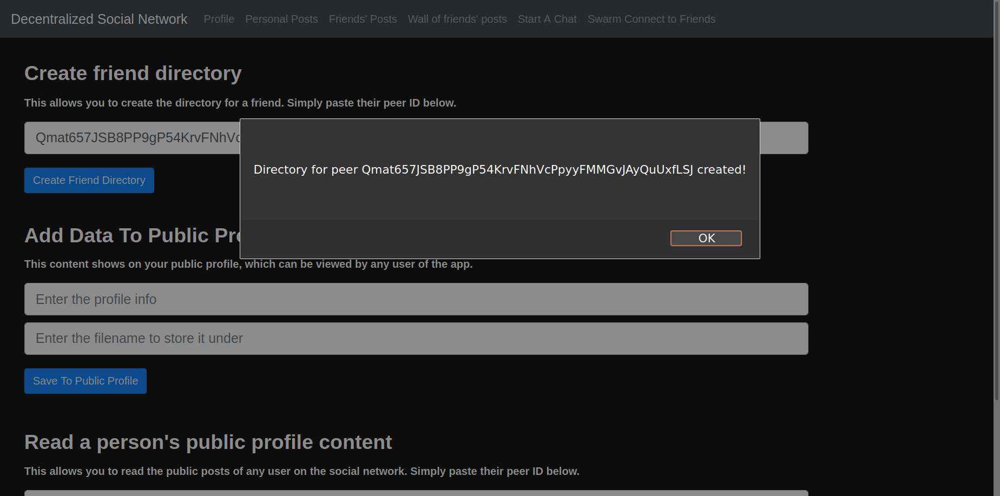
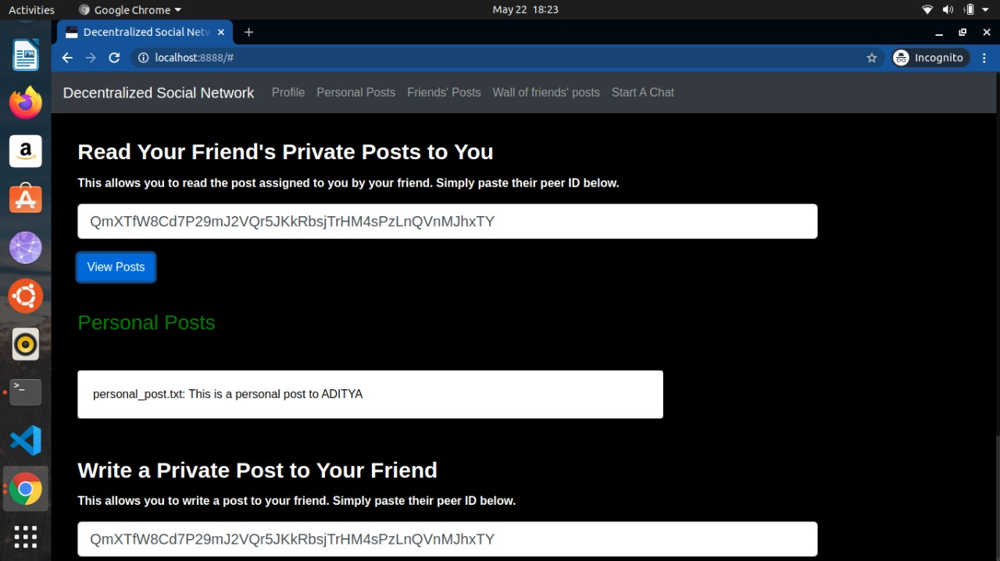

# Decentralized Secure Social Network

## Table of contents

- [General Info](#general-info)
- [Screenshots](#screenshots)
  - [Username prompt](#username-prompt)
  - [Front page](#front-page)
  - [Adding a friend](#adding-a-friend)
  - [Viewing personal posts written by a friend to you](#viewing-personal-posts-written-by-a-friend-to-you)
  - [Viewing public posts of any peer](#viewing-public-posts-of-any-peer)
  - [Viewing posts shared by given friend](#viewing-posts-shared-by-given-friend)
  - [Wall of all friend posts of all your friends](#wall-of-all-friend-posts-of-all-your-friends)
  - [Friends List and Chat](#friends-list-and-chat)
  - [Private Chat](#private-chat)
  - [Group Chat](#group-chat)
- [Main Tools/Technologies](#main-toolstechnologies)
- [Setup](#setup)
  - [Starting the server](#starting-the-server)
  - [Using the web-app](#using-the-web-app)
- [TODO:](#todo)
- [Inspiration](#inspiration)

## General Info

In Decentralized systems, there is no single central location of data. Instead, multiple copies of the data are present on different nodes on the network. This solves many of the issues that are faced by a centralized model, by removing a single point of authority, ensuring that the user has complete control over their own data, and making sure that there is no single point of failure. However, this comes at the cost of many implementation challenges, which are dealt with in pretty interesting ways.  

This project aims to implement a Decentralized, Secure Social Network based on IPFS. In our Social Network model, everyone’s data is just ‘out there’ - many copies floating around in encrypted blobs that anyone can host or download but only friends can decrypt.

## Screenshots

## Username prompt  

## Front page  

## Adding a friend

### Viewing personal posts written by a friend to you

## Viewing public posts of any peer

## Viewing posts shared by given friend

## Wall of all friend posts of all your friends

## Friends List and Chat

## Private Chat

## Group Chat


## Main Tools/Technologies
* [JS IPFS](https://js.ipfs.io/)
* [Node.js](https://nodejs.org/en/)
* [Orbit-DB](https://github.com/orbitdb/orbit-db)
* [Orbit-Core](https://github.com/orbitdb/orbit-core)
* [Browserify](http://browserify.org/) and [Watchify](https://www.npmjs.com/package/watchify)

## Setup

### Starting the server

**1. Linux**  

Run the following in the project's root directory  
```bash
npm install
npm start
```

**2. Windows**  

First, in *package.json*, change   
``` 
"http-server": "~0.11.1", 
```  
to  
``` 
"http-server": "0.9.0", 
```  
then run  
```bash
npm install
npm start
```   
in the project's root directory  

### Using the web-app
Open your browser at `http://127.0.0.1:8888`  
Note the outputs in the console while using the website, for additional information.  


## TODO:
- Add security features into main app.


## Inspiration
https://courses.csail.mit.edu/6.857/2019/project/17-Foss-Pfeiffer-Woldu-Williams.pdf
